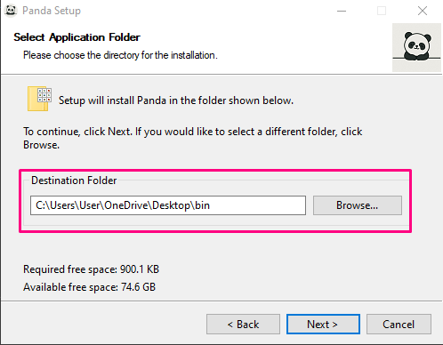
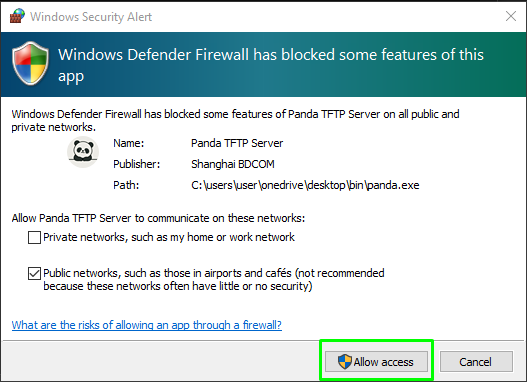

  

<h1 align="center">Panda</h1>

---

## Features

### General Features of Panda

1. TFTP server for file transfer
2. Supports read and write operations
3. Concurrent read sessions
4. Option negotiation (block size, transfer size, timeout)
5. Timeout and retry mechanisms for reliable transfers
6. Progress bar for a single active session (read or write)

### Potential Upcoming Features

1. Progress tracking for multiple concurrent sessions
2. Configurability (settings, allowed clients)
3. Performance optimizations
4. Support for additional TFTP extensions
5. Graphical User Interface (GUI)
6. Integration with other systems/services

### Why Use Panda Instead of tftpd64?

1. Panda is lightweight.
2. No need for interface selection.
3. No need to show the file directory.
4. Just place Panda in the directory where you usually save your bin files.
5. If you flash your modified bin file, you can confirm it's the correct version by comparing its size with the previous bin file size in Panda's transfer history.

### Installation Guide 

1. Click on Setup Panda.exe
2. Follow the procedure as usual.
3. In the ditectory selection select the exact directory where you usually save your bin files.
   

5. When select your directory the wizard automatically create a folder named **Panda**. Just remove the folder from the path.
   

7. Follow rest of the procedure as usual.

### After Installation

1. Open Panda from desktop shortcut or start menu.
2. A Windows Security Alert dialog from the Windows Defender Firewall will pop up.
   

4. Allow Panda to communicate through the firewall on a public network.
5. You are good to go.

